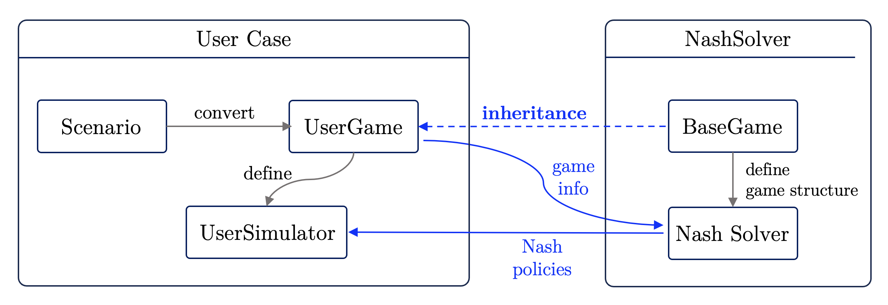

### Nash Solver for Stochastic Zero-sum Games

This program is an implementation of a generic solver for Nash equilibrium in stochastic zero-sum games.
It is designed to work with a variety of game structures and can be easily adapted for different scenarios.
A demonstration of the solver is provided in the `nash_solver_demo.ipynb` Jupyter notebook.

# Code Structure

There are two main components in this repository: the `NashSolver` class and the `BaseGame` class.

- `NashSolver`: This class implements the algorithm for finding the Nash equilibrium in a stochastic zero-sum game.
- `BaseGame`: This class serves as a base for defining the game structure. It is designed to be subclassed for specific
  game implementations.

The intended architecture is depicted in the following schematic.



# Installation

1. Clone the repository to your local machine.
2. cd into the directory where the repository is located.
   ```bash
   cd path/to/nash_solver_repo
   ```
3. Install the nash_solver package.
   ```bash
    pip install .
    ```

# Using the NashSolver

First import the necessary classes and define your game structure by subclassing or initializing `BaseGame`.
Here we use a simple rock-paper-scissor game as an example. 

```python
from nash_solver import NashSolver, BaseGame
import numpy as np

# initialize the game
rps_game = BaseGame(n_states=1, n_actions_1=3, n_actions_2=3)
```

Then, set up the transition dynamics and the reward function using the setting function.
More details on the structure of the transition matrices, compressed transitions for larger state space,
and reward functions can be found in the `BaseGame` class, specifically the setter functions.
```python
# set up the transition dynamics
transitions = [[np.identity(1) for _ in range(3)] for _ in range(3)]
rps_game.set_transitions(transitions)

# set up the reward function
rewards = np.zeros((1, 3, 3))
rewards[0, :, :] = np.array([
    #R  P   S
    [0, -1, 1],     # R
    [1, 0, -1],     # P
    [-1, 1, 0]])    # S
rps_game.set_rewards(rewards)
```

Finally, create an instance of `NashSolver` and call the `solve` method to find the Nash equilibrium.
For more options of the solver, see the `NashSolver` class.

If you are using multiple workers, make sure that you are running the code as a script, i.e., use the `if __name__ == "__main__"` condition. 

```python
# create an instance of NashSolver
solver = NashSolver(game=rps_game)

# solve for the Nash equilibrium
solver.solve(eps=1e-3,
             n_workers=1,
             verbose=True)
```
Since we only have a single state (the RPS game is a static game), the algorithm should converge in a single iteration. 
The solved Nash equilibrium is stored in the solver. One can access the solved game value and equilibrium as follows
```python
# get the solved game value
game_value = solver.V

# get the Nash policies
policy_1, policy_2 = solver.policy_1, solver.policy_2

# print the results
print("Game Value:", game_value[0])
print("Policy 1:", policy_1[0])
print("Policy 2:", policy_2[0])
```
The output should be:
```
Game Value: 0.0
Policy 1: [0.33333333 0.33333333 0.33333333]
Policy 2: [0.33333333 0.33333333 0.33333333]
```
which is the uniform equilibrium for the rock-paper-scissor game.

For a more detailed and complex example, see the `nash_solver_demo.ipynb` notebook, where we implement a pursuit-evasion game and animate the policies. 

# Notes on the Shapley Method
The implemented solver uses the Shapley Method to update the values.
The Shapley method is an extension to the value iteration (VI) in the single-agent Markov Decision Process (MDP) setting.
It is similar to the VI update, but instead of using a max operator to update value, we use the Nash value. 

The algorithm keeps two sets of values, the Value (`solver.V` and `solver.V_`) and the Q-values (`solver.Q`).
`solver.V` stores the game value at each state and thus have a dimension/length of the number of states, i.e., $|\mathcal{S}|$.
`solver.Q` store the value of taking an action at each state and thus have a dimension $|\mathcal{S}| \times |\mathcal{A}^1| \times |\mathcal{A}^2|$.
The Q-value may be padded with zeros if the number of actions is state-dependent.

**Update Q-values** (`solver._update_q`):
$$Q_{k+1}(s, a^1, a^2) \gets R(s, a^1, a^2) + \gamma \sum_{s' \in \mathcal{S}} \mathcal{T}(s'|s, a^1, a^2) V_k(s').$$

**Update Value** (`solver._update_v_`):
$$V_{k+1}(s) \gets \mathrm{Nash}\big(Q_k(s, a^1, a^2)\big) = \max_{\mathbf{\pi}^1(s)} \min_{\mathbf{\pi}^2(s)} {\pi^1(s)}^\top \mathbf{Q}_{k+1}(s)\pi^2(s),$$
where $\mathbf{Q}(s)$ is the Q-table at state $s$, i.e. $[\mathbf{Q}(s)]_{a^1, a^2} =Q(s,a^1, a^2)$.
And $\pi^1(s)$ and $\pi^2(s)$ are the action distributions of player 1 and player 2 at state $s$, respectively.

The max-min optimization can be solved via as a linear programming problem. 
It is essentially solving a matrix game with the payoff matrix $\mathbf{Q}_s$.
```math
\begin{alignat*}{2}
    \max_{v, \pi^1_s} \quad & \quad v \\
    \text{such that} \quad & \mathbf{Q}_s ^\top \pi^1_s \geq v \mathbf{1}, \\
    & \mathbf{1}^\top \pi^1_s = 1, \\
    & \pi^1_s \geq 0.
\end{alignat*}
```
The above optimization is solved via the `scipy.optimize.linprog` function, and the optimal/Nash equilibrium policy of Player 1 (maximizing agent)
is obtained from $\pi^1_s$. 
The minimizing Player 2's policy can be obtained from the dual variables for the optimality constraint $\mathbf{Q}_s ^\top \pi^1_s \geq v \mathbf{1}$.
This optimization problem is implemented in the `nash_utilities/linprog_solve`.